### Cоздаем genelist для возможности цветного отображения log2FoldChange

```{r}
kegg_gene_list <- res_T16_T0_padj$foldChange
names(kegg_gene_list) <- res_T16_T0_padj$entrez

kegg_gene_list_s <- res_s_c_padj$log2FoldChange
names(kegg_gene_list_s) <- res_s_c_padj$entrez
```


### Анализ enrichKEGG

#### Stable vs Control. Активация

```{r}
eKegg_s_c_up <- enrichKEGG(gene = s_c_up$entrez,
           organism = "hsa",
           keyType = "kegg",
           pvalueCutoff = 0.05,
           pAdjustMethod = "BH",
           #universe,
           minGSSize = 10,
           maxGSSize = 500,
           qvalueCutoff = 0.2,
           use_internal_data = FALSE)

dotplot(eKegg_s_c_up, showCategory = 20)
```

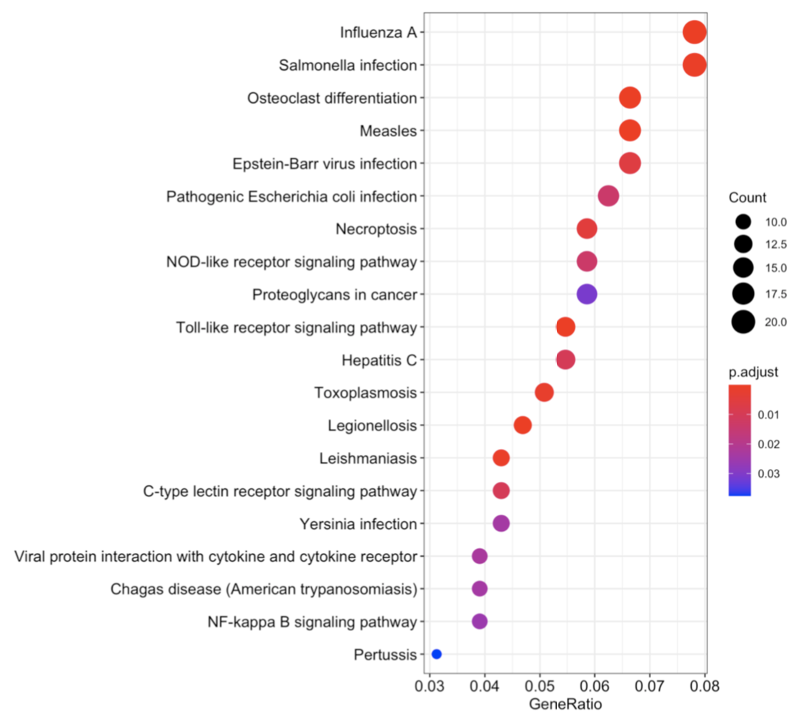

```{r}
# write.csv(as.data.frame(eKegg_s_c_up), 's_c_up.csv')

geneList = df_eKegg_s_c_up$ID[c(1,2,4,6,8)] #Наборы номеров категорий 1,2,4,6,8  5,12,13,18  15,21
eKegg_s_c_up_fc <- eKegg_s_c_up 
eKegg_s_c_up_fc@result <- eKegg_s_c_up_fc@result[eKegg_s_c_up_fc@result$ID %in% as.character(geneList), ]
eKegg_s_c_up_fc<- setReadable(eKegg_s_c_up_fc, 'org.Hs.eg.db', 'ENTREZID')

cnetplot(eKegg_s_c_up_fc, colorEdge = TRUE, foldChange = kegg_gene_list_s)
```

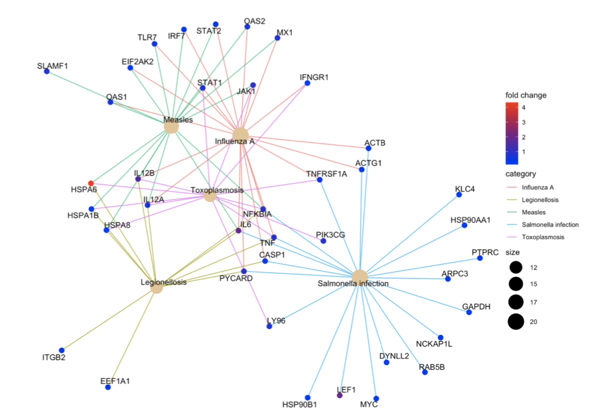

```{r}
# Активация при стабильной экспрессии (категории 1,2,4,6,8)
```

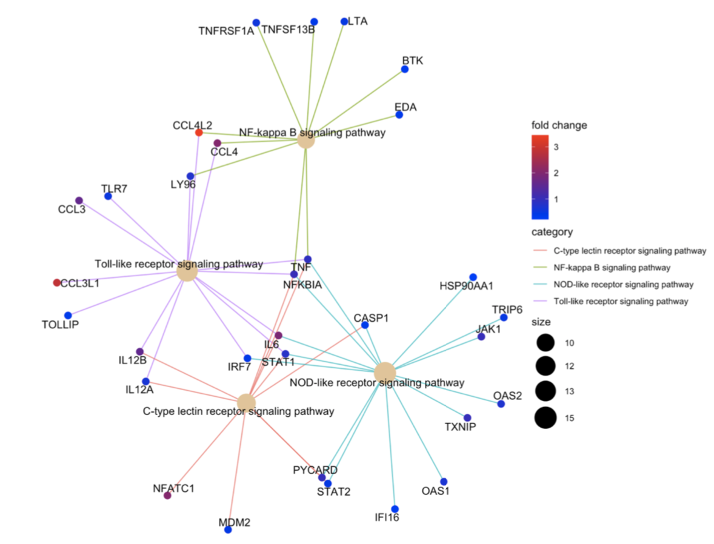

```{r}
# Активация при стабильной экспрессии (категории 5,12,13,18)
```

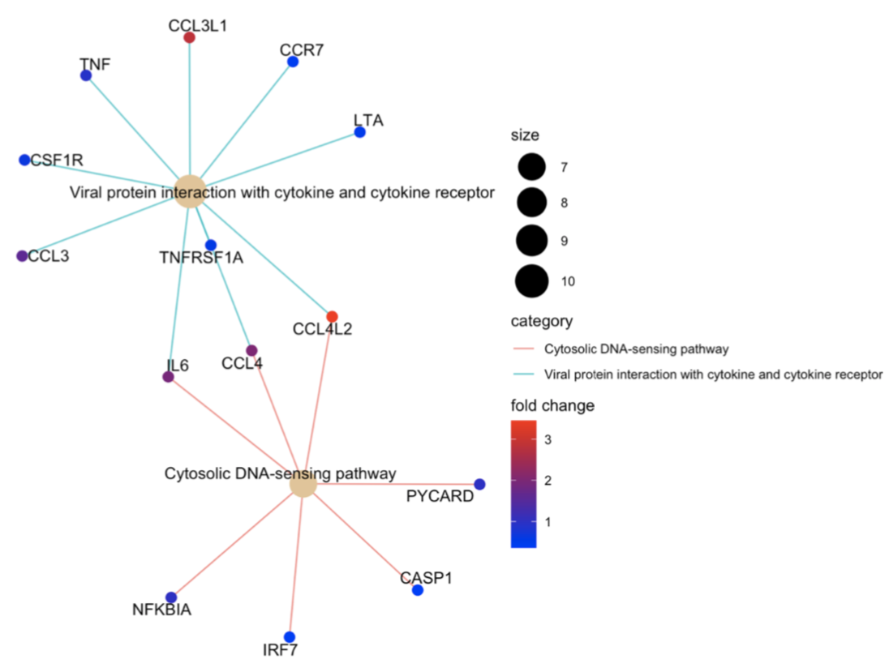

```{r}
# Активация при стабильной экспрессии (категории 15,21)
```


#### Tat 16 hours vs Tat 0 hours. Активация

```{r}
eKegg_T16_T0_up <- enrichKEGG(gene = T16_T0_up$entrez,
                            organism = "hsa",
                            keyType = "kegg",
                            pvalueCutoff = 0.05,
                            pAdjustMethod = "BH",
                            #universe,
                            minGSSize = 10,
                            maxGSSize = 500,
                            qvalueCutoff = 0.2,
                            use_internal_data = FALSE)

dotplot(eKegg_T16_T0_up, showCategory = 20)

```

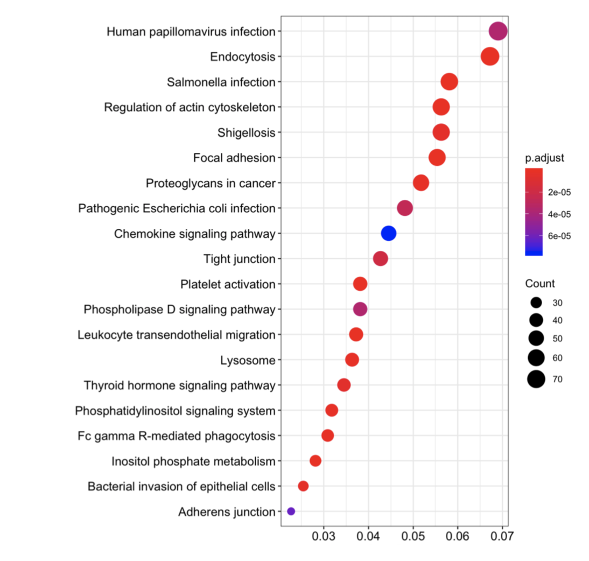

```{r}
# write.csv(as.data.frame(eKegg_T16_T0_up), 'T16_T0_up.csv')
df_eKegg_T16_T0_up<- as.data.frame(eKegg_T16_T0_up)

geneList = df_eKegg_T16_T0_up$ID[c(39, 75, 76, 77)] #39,75,76,77  43,83,69,36  2,15,19  2,6,15,19  1,6
eKegg_T16_T0_up_fc <- eKegg_T16_T0_up
eKegg_T16_T0_up_fc@result <- eKegg_T16_T0_up_fc@result[eKegg_T16_T0_up_fc@result$ID %in% as.character(geneList), ]
eKegg_T16_T0_up_fc<- setReadable(eKegg_T16_T0_up_fc, 'org.Hs.eg.db', 'ENTREZID')

cnetplot(eKegg_T16_T0_up_fc, colorEdge = TRUE, foldChange=kegg_gene_list, showCategory = 9)

```

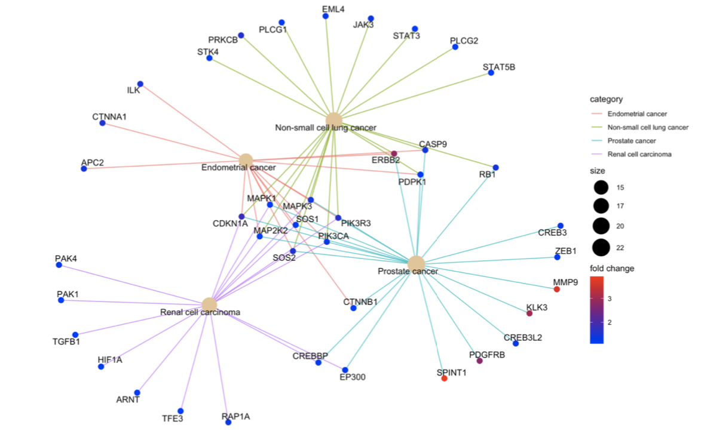

```{r}
# Активация при индуцибельной экспрессии (канцерогенез 39,75,76,77)
```

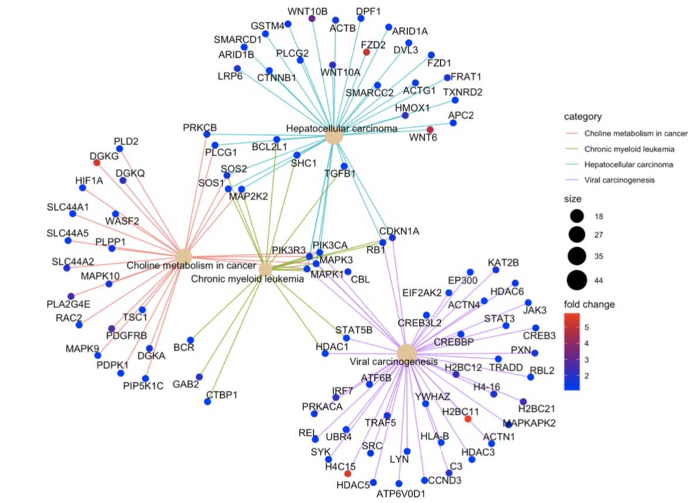

```{r}
# Активация при индуцибельной экспрессии (канцерогенез 43,83,69,36)
```

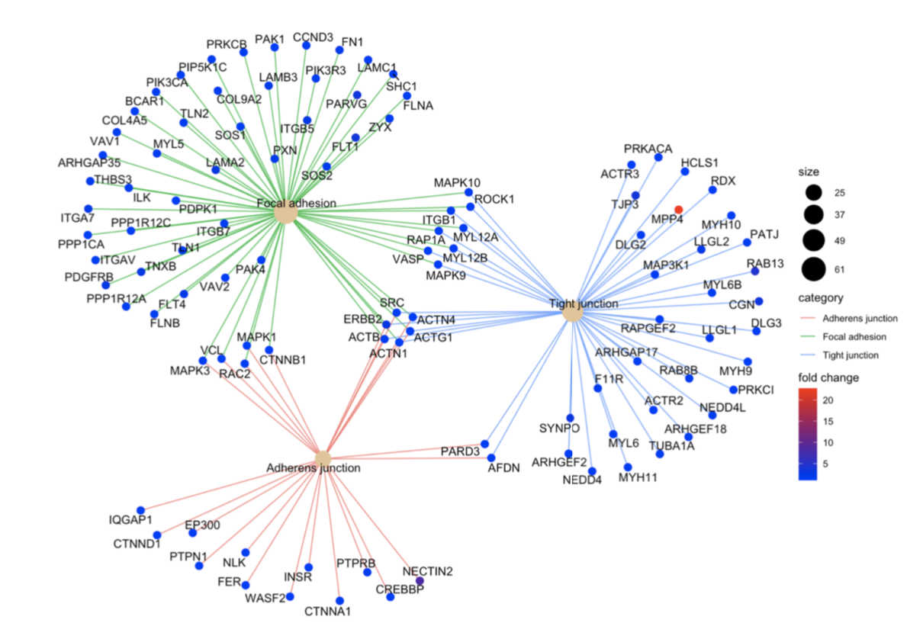

```{r}
# Активация при индуцибельной экспрессии (клеточные контакты и адгезия 2,15,19)
```

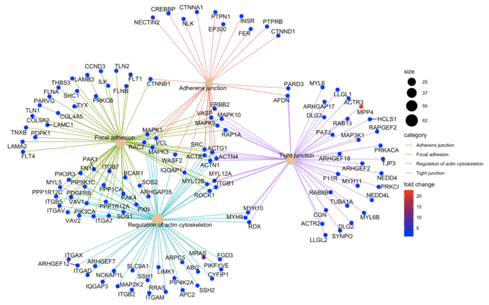

```{r}
# Активация при индуцибельной экспрессии (клеточные контакты, адгезия, регуляция активного цитоскелета 2,6,15,19)
```

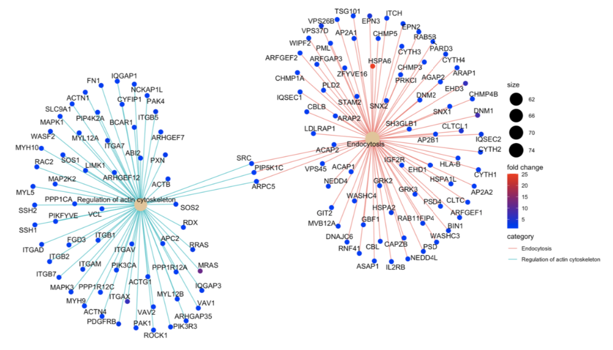

```{r}
# Активация при индуцибельной экспрессии (актиновый цитоскелет и эндоцитоз 1,6)
```

#### Tat 16 hours Tat 0 hours. Ингибирование

```{r}
eKegg_T16_T0_down <- enrichKEGG(gene = T16_T0_down$entrez,
                              organism = "hsa",
                              keyType = "kegg",
                              pvalueCutoff = 0.05,
                              pAdjustMethod = "BH",
                              #universe,
                              minGSSize = 10,
                              maxGSSize = 500,
                              qvalueCutoff = 0.2,
                              use_internal_data = FALSE)

dotplot(eKegg_T16_T0_down, showCategory = 20)
```

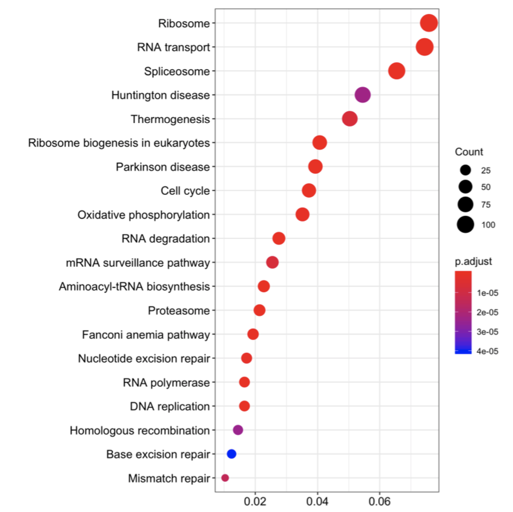

```{r}
#write.csv(as.data.frame(eKegg_T16_T0_down), 'T16_T0_down.csv')

df_eKegg_T16_T0_down<- as.data.frame(eKegg_T16_T0_down)
geneList = df_eKegg_T16_T0_down$ID[c(3)] #3  7,9  9,14,17,20  
eKegg_T16_T0_down_fc <- eKegg_T16_T0_down
eKegg_T16_T0_down_fc@result <- eKegg_T16_T0_down_fc@result[eKegg_T16_T0_down_fc@result$ID %in% as.character(geneList), ]
eKegg_T16_T0_down_fc<- setReadable(eKegg_T16_T0_down_fc, 'org.Hs.eg.db', 'ENTREZID')

cnetplot(eKegg_T16_T0_down_fc, colorEdge = TRUE, foldChange=kegg_gene_list)
```

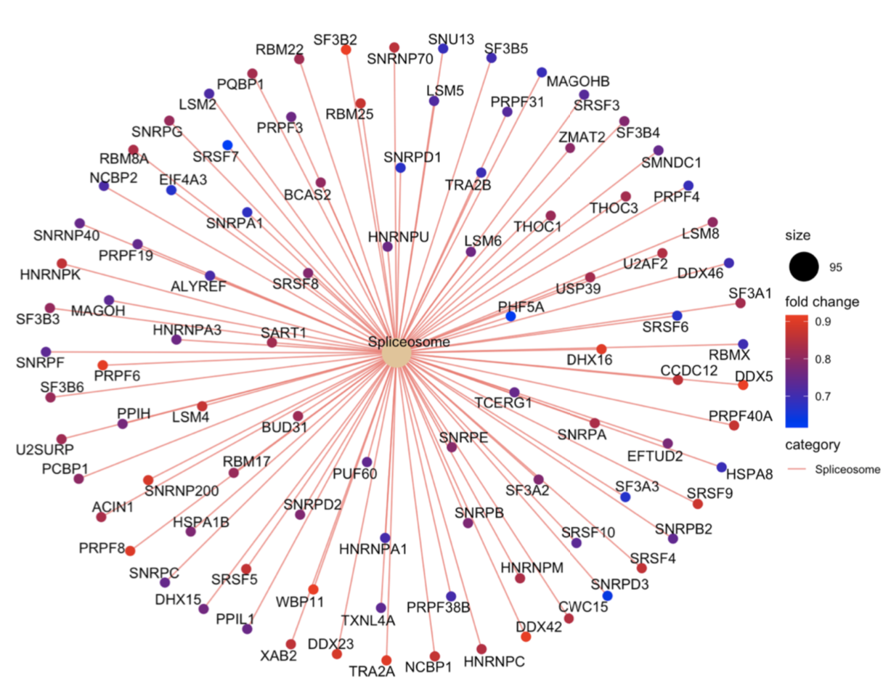

```{r}
#Ингибирование при индуцибельной экспрессии (сплайсосома 3)
```

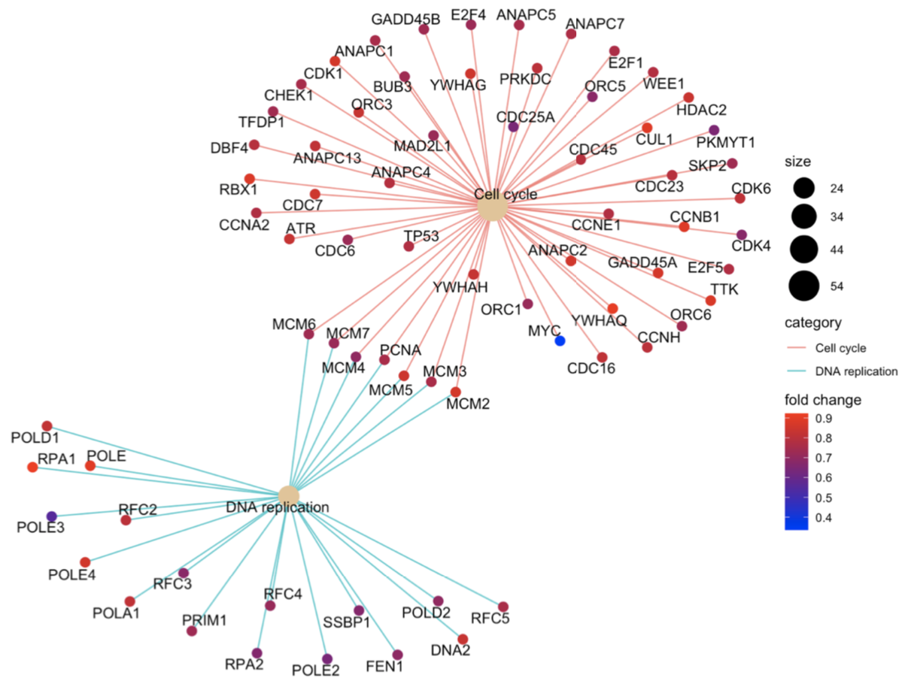

```{r}
#Ингибирование при индуцибельной экспрессии (Репликация ДНК и клеточный цикл 7,9)
```

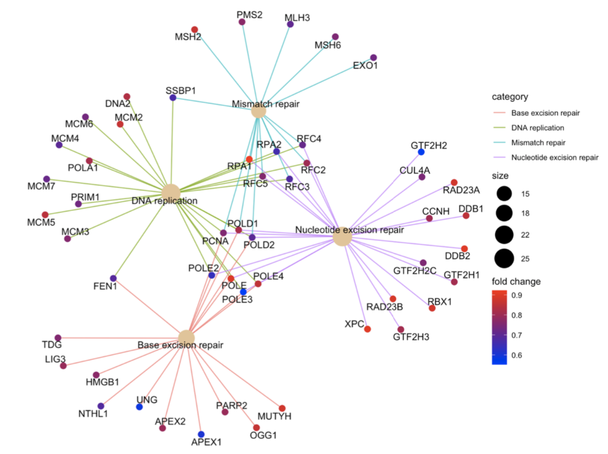

```{r}
#Ингибирование при индуцибельной экспрессии (Репликация ДНК и репарация 9,14,17,20)

```

#### Фильтрация T16 T0 DOWN по Foldchange (снижение экспрессии в 1.5 раза)

```{r}
T16_T0_down_FC_15 <- T16_T0_down[T16_T0_down$foldChange < 0.67,]

eKegg_T16_T0_down_FC_15 <- enrichKEGG(gene = T16_T0_down_FC_15$entrez,
                                      organism = "hsa",
                                      keyType = "kegg",
                                      pvalueCutoff = 0.05,
                                      pAdjustMethod = "BH",
                                      #universe,
                                      minGSSize = 10,
                                      maxGSSize = 500,
                                      qvalueCutoff = 0.2,
                                      use_internal_data = FALSE)

df_eKegg_T16_T0_down_FC_15 <- as.data.frame(eKegg_T16_T0_down_FC_15)

geneList = df_eKegg_T16_T0_down_FC_15$ID[c(2,4,6)]
eKegg_T16_T0_down_FC_15_fc <- eKegg_T16_T0_down_FC_15
eKegg_T16_T0_down_FC_15_fc@result <- eKegg_T16_T0_down_FC_15_fc@result[eKegg_T16_T0_down_FC_15_fc@result$ID %in% as.character(geneList), ]
eKegg_T16_T0_down_FC_15_fc<- setReadable(eKegg_T16_T0_down_FC_15_fc, 'org.Hs.eg.db', 'ENTREZID')


cnetplot(eKegg_T16_T0_down_FC_15_fc, colorEdge = TRUE, foldChange=kegg_gene_list)
```

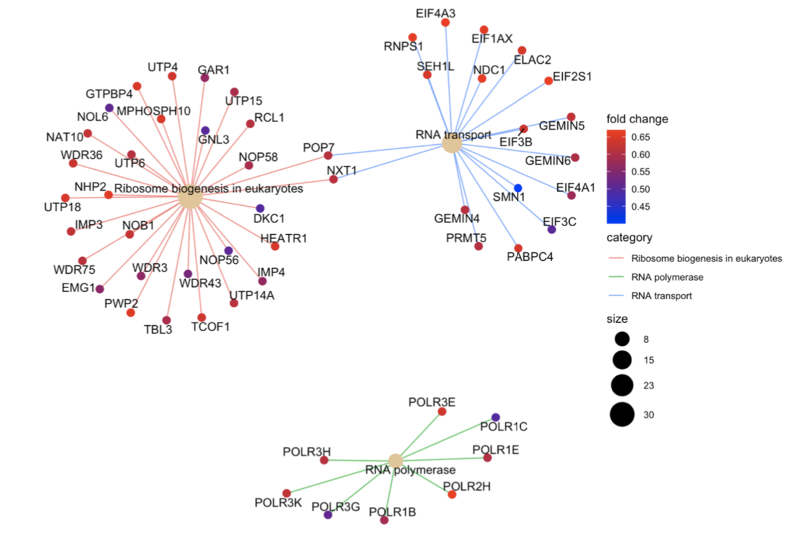

```{r}
# Ингибирование при индуцибельной экспрессии (Биогенез рибосом и РНК 2,4,6)
```
